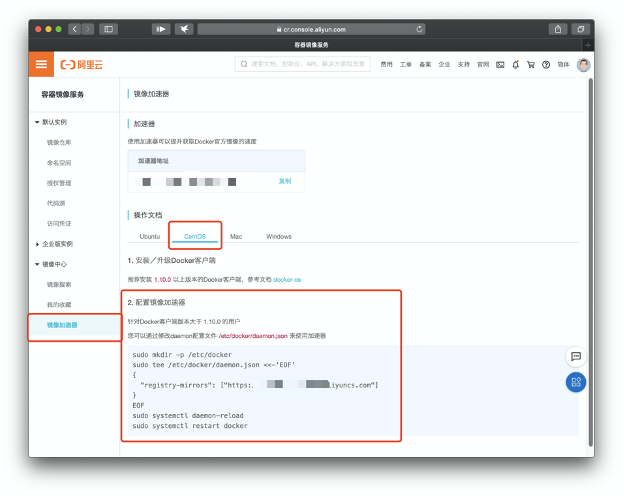

# docker

## 1. 配置`yum`镜像源

::: tip 为什么是`centos7`不是`centos8`？
经过博主调研，centos8已被弃用，centos7更稳定
:::

1、跳转到yum目录并查看

```sh
cd /etc/yum.repos.d/ && ls
```

2、备份CentOS-Base.repo

```sh
mv /etc/yum.repos.d/CentOS-Base.repo /etc/yum.repos.d/CentOS-Base.repo.backup
```

3、下载阿里云Centos-7.repo文件（根据自己的需求下载不同的镜像源）

```sh
curl -o /etc/yum.repos.d/CentOS-Base.repo https://mirrors.aliyun.com/repo/Centos-7.repo
```

4、查看已启用的源

```sh
yum repolist enabled
```

5、清除yum缓存

```sh
yum clean all
```

6、缓存阿里云镜像：

```sh
yum makecache
```

7、测试阿里云镜像：

```sh
yum list
```

## 2. 安装配置docker

### 2.1 安装docker

1、安装所需依赖

```sh
yum install -y yum-utils device-mapper-persistent-data lvm2
```

`device-mapper-persistent-data`: 存储驱动，Linux上的许多高级卷管理技术 `lvm`: 逻辑卷管理器，用于创建逻辑磁盘分区使用

2、添加阿里云的Docker镜像源

```sh
sudo yum-config-manager --add-repo http://mirrors.aliyun.com/docker-ce/linux/centos/docker-ce.repo
```

3、安装docker

```sh
yum install docker-ce
```

4、使用 systemctl 启动docker

```sh
systemctl start docker
```

5、设置开机启动

```sh
systemctl enable docker
```

6、查看docker是否安装成功

```sh
docker -v
```

显示版本信息即为成功

### 2.2 更新配置

* 1、配置阿里云镜像加速

（1）获取阿里云镜像页面地址：
[https://cr.console.aliyun.com/cn-hangzhou/instances/mirrors](https://cr.console.aliyun.com/cn-hangzhou/instances/mirrors)



（2）命令

第一步，创建docker目录：

```sh
sudo mkdir -p /etc/docker
```

第二步，写入daemon文件：

```console
sudo tee /etc/docker/daemon.json <<-'EOF'
{
  "registry-mirrors": ["https://镜像地址"]
}
EOF
```

或者使用`http://hub-mirror.c.163.com`作为镜像地址

第三步，重启daemon：

```sh
sudo systemctl daemon-reload
```

第四步，重启docker：

```sh
sudo systemctl restart docker
```

* 2、配置DNS

（1）修改配置文件

```sh
vi /etc/sysconfig/network-scripts/ifcfg-eth0
```

::: info 添加内容
DNS1=8.8.8.8

DNS2=114.114.114.114
:::

（2）重启网络服务

```sh
service network restart
```

## 3. docker-compose

::: tip 说明
`docker-compose`安装的前提是先安装`docker`

旧版本和当前用户，不写进该博客，可参考原博客
:::

### 3.1 官网路径

github地址：[https://github.com/docker/compose](https://github.com/docker/compose)

官方文档：[https://docs.docker.com/compose/cli-command/#install-on-linux](https://docs.docker.com/compose/cli-command/#install-on-linux)

### 3.2 给所有用户安装

```bash{1}
mkdir -p /usr/local/lib/docker/cli-plugins
curl -SL https://github.com/docker/compose/releases/download/v2.27.0/docker-compose-linux-x86_64 -o /usr/local/lib/docker/cli-plugins/docker-compose
chmod +x /usr/local/lib/docker/cli-plugins/docker-compose
docker compose version
```
