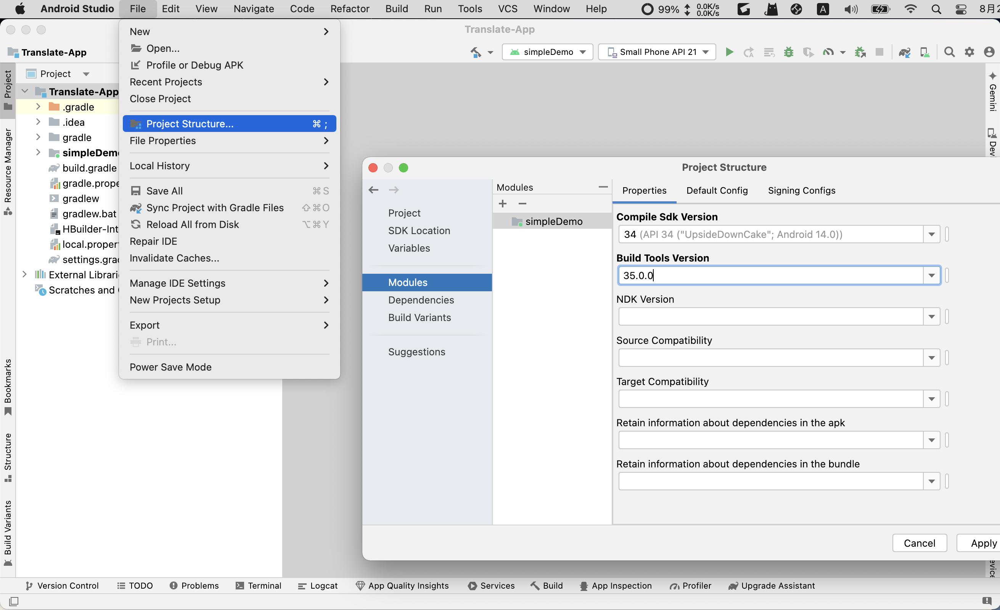
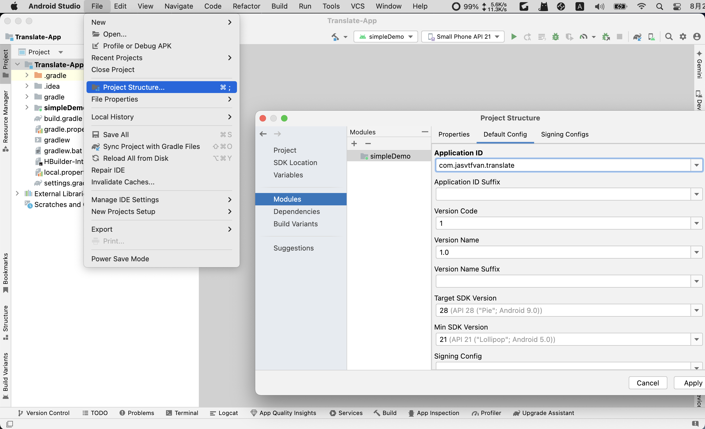
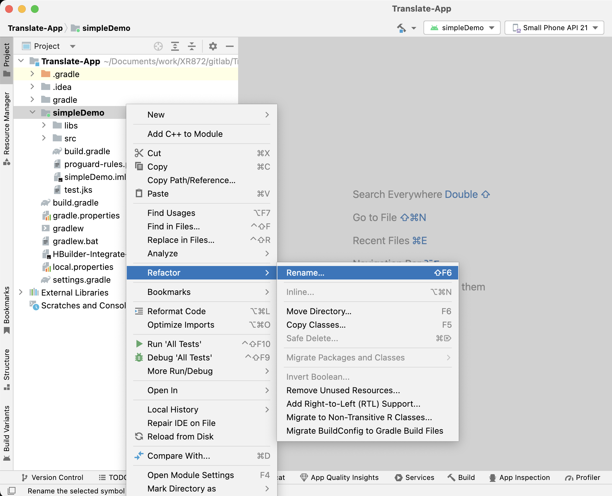

# uni-app android

::: tip 环境版本
macOS Monterey12.2 Intel

HBuilderX 4.23

Android Studio Koala | 2024.1.1 Patch 1
:::

官网地址: [https://uniapp.dcloud.net.cn/](https://uniapp.dcloud.net.cn/)

官网参考: [https://nativesupport.dcloud.net.cn/AppDocs/usesdk/android.html](https://nativesupport.dcloud.net.cn/AppDocs/usesdk/android.html)

## 1. java 环境切换

1. 安装不同版本`java`，具体步骤省略

2. 查看`bash_profile`

```bash
cat ~/.bash_profile
```

```console
export NVM_DIR="$HOME/.nvm"
[ -s "$NVM_DIR/nvm.sh" ] && \. "$NVM_DIR/nvm.sh" # This loads nvm
export PATH="/Users/jasvtfvan/Documents/FullStack/flutter/bin:$PATH"
export PUB_HOSTED_URL=https://pub.flutter-io.cn
export FLUTTER_STORAGE_BASE_UUL=https://storage.flutter-io.cn
[ -s "$NVM_DIR/bash_completion" ] && \. "$NVM_DIR/bash_completion"  # This loads nvm bash_completion

export ANDROID_HOME=$HOME/Library/Android/sdk
export PATH=$PATH:$ANDROID_HOME/tools
export PATH=$PATH:$ANDROID_HOME/tools/bin
export PATH=$PATH:$ANDROID_HOME/platform-tools
export PATH=$PATH:$ANDROID_HOME/emulator

export JMETER_HOME=/Users/jasvtfvan/Documents/PortableApplication/apache-jmeter-5.4
export JAVA_8_HOME=/Library/Java/JavaVirtualMachines/jdk1.8.0_181.jdk/Contents/Home
export JAVA_17_HOME=/Library/Java/JavaVirtualMachines/jdk-17.jdk/Contents/Home

export PATH=$JAVA_HOME/bin:$PATH:.:$JMETER_HOME/bin:$PATH
export CLASSPATH=.:$JAVA_HOME/lib/dt.jar:$JAVA_HOME/lib/tools.jar:$JMETER_HOME/lib/ext/ApacheJMeter_core.jar:$JMETER_HOME/lib/jorphan.jar

alias jdk8='export JAVA_HOME=$JAVA_8_HOME'
alias jdk17='export JAVA_HOME=$JAVA_17_HOME'

export MAVEN_HOME=/Users/jasvtfvan/Documents/PortableApplication/apache-maven-3.8.5
export PATH=$PATH:$MAVEN_HOME/bin

export HOMEBREW_BOTTLE_DOMAIN=https://mirrors.ustc.edu.cn/homebrew-bottles

alias open_proxy='export https_proxy=http://127.0.0.1:7897 http_proxy=http://127.0.0.1:7897 all_proxy=socks5://127.0.0.1:7897'
alias close_proxy='unset http_proxy;unset https_proxy;unset all_proxy'
alias test_proxy='curl -v google.com'
```

>`.bash_profile`和`.zshrc`相关权限说明,参考`node/nvm`和`go/gvm`

3. 查看`java`版本并切换至`java8`

可以不必切换到`java8`

```bash
java -version
jdk8
```

```console
java version "1.8.0_181"
Java(TM) SE Runtime Environment (build 1.8.0_181-b13)
Java HotSpot(TM) 64-Bit Server VM (build 25.181-b13, mixed mode)
```

## 2. HBuilderX 创建项目

### 2.1 下载安装

官网地址: [https://www.dcloud.io/hbuilderx.html](https://www.dcloud.io/hbuilderx.html)

历史版本: [https://hx.dcloud.net.cn/Tutorial/HistoryVersion](https://hx.dcloud.net.cn/Tutorial/HistoryVersion)

下载`4.2.3`版本

### 2.2. 创建`uni-app`项目


绑定开发者账户后，自动生成`Appid`，并在开发者中心可以查看

### 2.3. 安装`uview-plus`UI库

官网地址: [https://uview-plus.jiangruyi.com/components/install.html](https://uview-plus.jiangruyi.com/components/install.html)

* 这里使用`npm`方式安装

参考地址: [https://uview-plus.jiangruyi.com/components/npmSetting.html](https://uview-plus.jiangruyi.com/components/npmSetting.html)

1. HBuilderX安装`scss/sass编译`插件

插件市场地址: [https://ext.dcloud.net.cn/plugin?id=2046](https://ext.dcloud.net.cn/plugin?id=2046)

2. 安装依赖


```shell
npm install dayjs
npm install uview-plus
npm install clipboard
```

3. 修改`main.js`

```js
import uviewPlus from 'uview-plus'
...
// #ifdef VUE3
import { createSSRApp } from 'vue'
export function createApp() {
  const app = createSSRApp(App)
  app.use(uviewPlus)
  return {
    app
  }
}
// #endif
```

4. 修改`uni.scss`

```js
...
@import 'uview-plus/theme.scss';
```

5. 修改`App.vue`

```scss
<style lang="scss">
	/* 注意要写在第一行，同时给style标签加入lang="scss"属性 */
	@import "uview-plus/index.scss";
	/*每个页面公共css */
</style>
```

6. 修改`pages.json`

::: info 温馨提示
uni-app为了调试性能的原因，修改easycom规则不会实时生效，配置完后，您需要重启HX或者重新编译项目才能正常使用uview-plus的功能。

请确保您的pages.json中只有一个easycom字段，否则请自行合并多个引入规则。
:::

7. 页面`demo`

```html
<template>
    <view style="padding: 20px;">
        <up-button type="primary" text="确定"></up-button>
        <up-button type="primary" :plain="true" text="镂空"></up-button>
        <up-button type="primary" :plain="true" :hairline="true" text="细边"></up-button>
        <up-button type="primary" :disabled="true" text="禁用"></up-button>
        <up-button type="primary" loading loadingText="加载中"></up-button>
        <up-button type="primary" icon="map" text="图标按钮"></up-button>
        <up-button type="primary" shape="circle" text="按钮形状"></up-button>
        <up-button text="渐变色按钮" color="linear-gradient(to right, rgb(66, 83, 216), rgb(213, 51, 186))"></up-button>
        <up-button type="primary" size="small" text="大小尺寸"></up-button>
    </view>
</template>
```

### 2.4. 生成打包资源


## 3. 开发者中心

官网地址: [https://dev.dcloud.net.cn](https://dev.dcloud.net.cn)

### 3.1. 管理应用

分别点击: 应用管理 -> 我的应用 -> 应用名称


### 3.2. 创建云端证书


点击`创建证书`，创建完成后，点击`证书详情` -> `查看证书密码` -> `下载证书`

### 3.3. 生成离线打包key

1. 新增

新增时根据`证书详情`获取创建时的表单信息（只填必填项即可）


2. 创建


3. 查看


## 4. 离线Android项目

官方文档: [https://nativesupport.dcloud.net.cn/AppDocs/usesdk/android.html](https://nativesupport.dcloud.net.cn/AppDocs/usesdk/android.html)

### 4.1. 导入`Android Studio`

1. 下载地址: [https://nativesupport.dcloud.net.cn/AppDocs/download/android.html](https://nativesupport.dcloud.net.cn/AppDocs/download/android.html)

>注意，下载的版本号需要跟`HBuilderX`版本号一致

2. 复制项目，目录如下

修改文件夹为`Translate-App`


3. 修改`Android Studio` `Gradle JDK`版本为1.8


4. 修改模块的`sdk`版本

这里`compileSdk`要切换到最高版本，然后`Apply`





5. 修改模块名称为`app`



### 4.2. 拷贝资源文件

1. 从`HBuilderX`拷贝静态资源到app主模块


### 4.3. 配置更新

1. `/Translate-App/app/src/main/Androidmanifest.xml`

```console
<meta-data android:name="dcloud_appkey" android:value="b1bf***1b89" />
```

2. `/Translate-App/app/src/main/res/values/strings.xml`

```console
<resources>
    <string name="app_name">Translate-App</string>
</resources>
```

3. `/Translate-App/app/src/main/assets/data/dcloud_control.xml`

生成自定义基座，需要在根节点下添加debug="true"和syncDebug="true"

```console
<hbuilder debug="true" syncDebug="true">
<apps>
    <app appid="__UNI__D44D05C" appver="1.0.0"/>
</apps>
</hbuilder>
```

4. `/Translate-App/app/build.gradle`

从开发者中心下载证书，放到 `/Translate-App/app/`目录下

```console
android {
    ...
    defaultConfig {
        applicationId "com.jasvtfvan.translate"
        ...
    }

    signingConfigs {
        config {
            keyAlias '__uni__d44d05c'
            keyPassword '开发者中心证书详情里拿到'
            storeFile file('__UNI__D44D05C.keystore')
            storePassword '同keyPassword'
            v1SigningEnabled true
            v2SigningEnabled true
        }
    }

    buildTypes {
            debug {
                signingConfig signingConfigs.config
                ...
            }
            release {
                signingConfig signingConfigs.config
                ...
            }
    }
    ...
}
```

### 4.4. 打包apk

1. studio打包

`Build` -> `Generate Signed App Bundle / APK` -> `APK` -> 下图 -> Next -> Release


2. 打包后apk所在路径

`/app/release/app-release.apk`

## 5. HBuilderX 云打包

### 5.1. 生成`.keystore`

1. 查看`jdk`地址

```bash
/usr/libexec/java_home -V
```

```console
Matching Java Virtual Machines (3):
    17.0.10 (x86_64) "Oracle Corporation" - "Java SE 17.0.10" /Library/Java/JavaVirtualMachines/jdk-17.jdk/Contents/Home
    1.8.181.13 (x86_64) "Oracle Corporation" - "Java" /Library/Internet Plug-Ins/JavaAppletPlugin.plugin/Contents/Home
    1.8.0_181 (x86_64) "Oracle Corporation" - "Java SE 8" /Library/Java/JavaVirtualMachines/jdk1.8.0_181.jdk/Contents/Home
/Library/Java/JavaVirtualMachines/jdk-17.jdk/Contents/Home
```

2. 进入`JDK`所在目录

```bash
cd /Library/Java/JavaVirtualMachines/jdk1.8.0_181.jdk/Contents/Home
```

3. 输入命令生成`.keystore`

```bash
sudo keytool -genkey -alias AAAAAA -keyalg RSA -validity 36500 -keysize 1024 -keystore java8.keystore -v
```

查看密钥信息(123456)

```bash
sudo keytool -list -v -keystore java8.keystore
```

### 5.2. 选择发行


### 5.3. 选择证书

当前选择`自定义证书`，也可以选择`云证书`（在开发者中心查看）


### 5.4. 下载`apk`


## 6. 开发调试

### 6.1. HBuilderX 真机调试

* `android掌上学习机`(android5.1.1)

1. android手机
Settings->System->Developer options->开启顶部总开关(On)->Debugging->开启USB debugging

2. HBuilderX
选中项目->运行->运行到手机或模拟器->运行到Android App基座

* `华为手机`（尚未成功）

1. android手机
手机设置->关于手机->版本号（连点5下开启开发者模式），在开发人员选项菜单里开启USB调试

2. MAC连接`android`设备，安装驱动助手（如：华为荣耀，安装手机助手）
根据步骤一步步连接

3. MAC打开`关于本机`->`系统报告`->`硬件/USB`->`USB 3.1 总线`
找到华为设备，复制`厂商ID`

4. 打开MAC终端，输入命令

```bash
echo 0x12d1 >> ~/.android/adb_usb.ini
```

5. 重启adb（HBuilderX）

### 6.2. HBuilderX引入原生插件

1. 配置依赖
