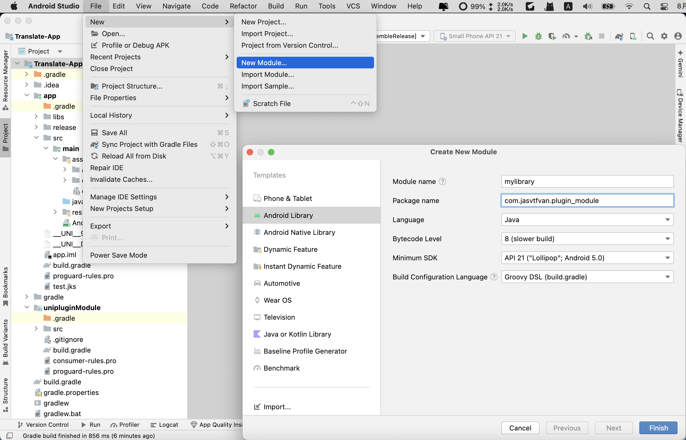
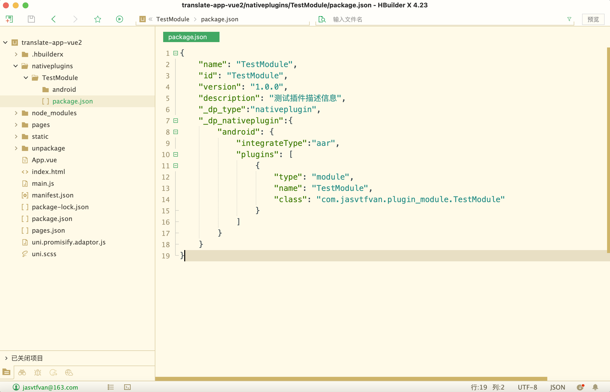
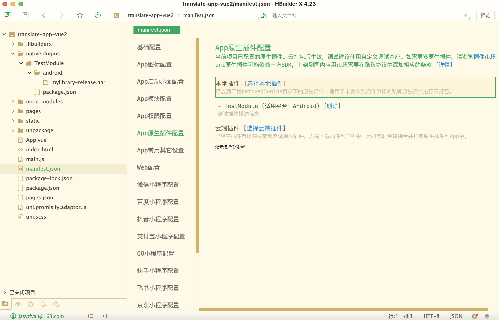

# uni-app android

::: tip 环境版本
macOS Monterey12.2 Intel

HBuilderX 4.23

Android Studio Koala | 2024.1.1 Patch 1
:::

官网地址: [https://uniapp.dcloud.net.cn/](https://uniapp.dcloud.net.cn/)

官网参考: [https://nativesupport.dcloud.net.cn/AppDocs/usesdk/android.html](https://nativesupport.dcloud.net.cn/AppDocs/usesdk/android.html)

## 1. HBuilderX 创建项目

### 1.1 下载安装 HBuilderX

1. 软件下载安装

官网地址: [https://www.dcloud.io/hbuilderx.html](https://www.dcloud.io/hbuilderx.html)

历史版本: [https://hx.dcloud.net.cn/Tutorial/HistoryVersion](https://hx.dcloud.net.cn/Tutorial/HistoryVersion)

下载`4.2.3`版本

2. 安装`scss/sass编译`插件

插件市场地址: [https://ext.dcloud.net.cn/plugin?id=2046](https://ext.dcloud.net.cn/plugin?id=2046)

### 1.2. `vue3`项目（不推荐）

::: danger 注意
部分`IOT`国内芯片只支持`android5.0`，不支持`vue3`

可能报错**WebView version is too low**
:::

1. 创建项目


绑定开发者账户后，自动生成`Appid`，并在开发者中心可以查看

2. 安装`uview-plus`UI库

官网地址: [https://uview-plus.jiangruyi.com/components/install.html](https://uview-plus.jiangruyi.com/components/install.html)

参考地址: [https://uview-plus.jiangruyi.com/components/npmSetting.html](https://uview-plus.jiangruyi.com/components/npmSetting.html)

* 这里使用`npm`方式安装

* 安装依赖


```shell
npm install dayjs
npm install uview-plus
npm install clipboard
```

* 修改`main.js`

```js
import uviewPlus from 'uview-plus'
...
// #ifdef VUE3
import { createSSRApp } from 'vue'
export function createApp() {
  const app = createSSRApp(App)
  app.use(uviewPlus)
  return {
    app
  }
}
// #endif
```

* 修改`uni.scss`

```js
...
@import 'uview-plus/theme.scss';
```

* 修改`App.vue`

```scss
<style lang="scss">
	/* 注意要写在第一行，同时给style标签加入lang="scss"属性 */
	@import "uview-plus/index.scss";
	/*每个页面公共css */
</style>
```

* 修改`pages.json`

::: info 温馨提示
uni-app为了调试性能的原因，修改easycom规则不会实时生效，配置完后，您需要重启HX或者重新编译项目才能正常使用uview-plus的功能。

请确保您的pages.json中只有一个easycom字段，否则请自行合并多个引入规则。
:::

```console
{
	"easycom": {
		"autoscan": true,
		// 注意一定要放在custom里，否则无效，https://ask.dcloud.net.cn/question/131175
		"custom": {
			"^u--(.*)": "uview-plus/components/u-$1/u-$1.vue",
			"^up-(.*)": "uview-plus/components/u-$1/u-$1.vue",
			"^u-([^-].*)": "uview-plus/components/u-$1/u-$1.vue"
		}
	},
	"pages": [
        ...
    ],
    ...
}
```

* 页面`demo`

```html
<template>
    <view style="padding: 20px;">
        <up-button type="primary" text="确定"></up-button>
        <up-button type="primary" :plain="true" text="镂空"></up-button>
        <up-button type="primary" :plain="true" :hairline="true" text="细边"></up-button>
        <up-button type="primary" :disabled="true" text="禁用"></up-button>
        <up-button type="primary" loading loadingText="加载中"></up-button>
        <up-button type="primary" icon="map" text="图标按钮"></up-button>
        <up-button type="primary" shape="circle" text="按钮形状"></up-button>
        <up-button text="渐变色按钮" color="linear-gradient(to right, rgb(66, 83, 216), rgb(213, 51, 186))"></up-button>
        <up-button type="primary" size="small" text="大小尺寸"></up-button>
    </view>
</template>
```

### 1.3. `vue2`项目（推荐）

::: tip 注意
部分`IOT`国内芯片只支持`android5.0`，需要使用`vue2`创建项目
:::

1. 创建项目

效果图参考`vue3``Vue版本`选择2，`Appid`在开发者中心可以查看

2. 安装`uview`UI库

官网地址: [https://uviewui.com/](https://uviewui.com/)

参考地址: [https://uviewui.com/components/npmSetting.html](https://uviewui.com/components/npmSetting.html)

* 这里使用`npm`方式安装

* 安装依赖


```shell
npm i uview-ui
```

* 修改`main.js`

```js
import App from './App';
import uView from "uview-ui";
...
Vue.use(uView);

const app = new Vue({
  ...App
})
app.$mount()
...
```

* 修改`uni.scss`

```js
...
@import 'uview-ui/theme.scss';
```

* 修改`App.vue`

```scss
<style lang="scss">
	/* 注意要写在第一行，同时给style标签加入lang="scss"属性 */
	@import "uview-ui/index.scss";
	/*每个页面公共css */
</style>
```

* 修改`pages.json`

::: info 温馨提示
uni-app为了调试性能的原因，修改easycom规则不会实时生效，配置完后，您需要重启HX或者重新编译项目才能正常使用uview-plus的功能。

请确保您的pages.json中只有一个easycom字段，否则请自行合并多个引入规则。
:::

```console
{
	"easycom": {
		"^u-(.*)": "uview-ui/components/u-$1/u-$1.vue"
	},
	"pages": [
        ...
    ],
    ...
}
```

* 页面`demo`

```html
<template>
    <view style="padding: 20px;">
        <u-button type="primary" text="确定"></u-button>
        <u-button type="primary" :plain="true" text="镂空"></u-button>
        <u-button type="primary" :plain="true" :hairline="true" text="细边"></u-button>
        <u-button type="primary" loading loadingText="加载中"></u-button>
        <u-button type="primary" icon="map" text="图标按钮"></u-button>
        <u-button type="primary" shape="circle" text="按钮形状"></u-button>
        <u-button text="渐变色按钮" color="linear-gradient(to right, rgb(66, 83, 216), rgb(213, 51, 186))"></u-button>
        <u-button type="primary" size="small" text="大小尺寸"></u-button>
    </view>
</template>
```

### 1.4. 生成打包资源


## 2. 开发者中心

官网地址: [https://dev.dcloud.net.cn](https://dev.dcloud.net.cn)

### 2.1. 管理应用

分别点击: 应用管理 -> 我的应用 -> 应用名称


### 2.2. 创建云端证书


点击`创建证书`，创建完成后，点击`证书详情` -> `查看证书密码` -> `下载证书`

### 2.3. 生成离线打包key

1. 新增

新增时根据`证书详情`获取创建时的表单信息（只填必填项即可）


2. 创建


3. 查看


## 3. 离线Android项目

官方文档: [https://nativesupport.dcloud.net.cn/AppDocs/usesdk/android.html](https://nativesupport.dcloud.net.cn/AppDocs/usesdk/android.html)

::: tip 各版本
`Gradle插件版本` classpath 'com.android.tools.build:gradle:4.1.1'

`Gradle版本` distributionUrl=https\://services.gradle.org/distributions/gradle-6.5-all.zip

`Gradle JDK` 1.8.0_422

`Compile Sdk Version` 30

`Build Tools Version` 30.0.3

`Target SDK Version` 34

`Min SDK Version` 21

`Version Code` 100

`Version Name` 1.0.0
:::

### 3.1. 导入`Android Studio`

1. 下载地址: [https://nativesupport.dcloud.net.cn/AppDocs/download/android.html](https://nativesupport.dcloud.net.cn/AppDocs/download/android.html)

>注意，下载的版本号需要跟`HBuilderX`版本号一致

2. 复制项目，目录如下


3. 修改项目名称、文件夹名称、文件名称

`Translate-App` `Translate-App.iml` `app` `app.iml`


4. 修改`Android Studio` `Gradle JDK`版本为1.8

* 注意需要`Android Studio`下载的安装版本，在`Gradle JDK`下拉可以点击`download`


### 3.2. 拷贝资源文件

1. 从`HBuilderX`拷贝静态资源到app主模块


### 3.3. 配置更新

1. `/Translate-App/app/src/main/Androidmanifest.xml`

```console
<meta-data android:name="dcloud_appkey" android:value="b1bf***1b89" />
```

2. `/Translate-App/app/src/main/res/values/strings.xml`

```console
<resources>
    <string name="app_name">Translate-App</string>
</resources>
```

3. `/Translate-App/app/src/main/assets/data/dcloud_control.xml`

生成自定义基座，需要在根节点下添加debug="true"和syncDebug="true"

```console
<hbuilder debug="true" syncDebug="true">
<apps>
    <app appid="__UNI__D44D05C" appver="1.0.0"/>
</apps>
</hbuilder>
```

4. `/Translate-App/app/build.gradle`

从开发者中心下载证书，放到 `/Translate-App/app/`目录下

```console
android {
    ...
    defaultConfig {
        applicationId "com.jasvtfvan.translate"
        ...
    }

    signingConfigs {
        config {
            keyAlias '__uni__d44d05c'
            keyPassword '开发者中心证书详情里拿到'
            storeFile file('__UNI__D44D05C.keystore')
            storePassword '同keyPassword'
            v1SigningEnabled true
            v2SigningEnabled true
        }
    }

    buildTypes {
            debug {
                signingConfig signingConfigs.config
                ...
            }
            release {
                signingConfig signingConfigs.config
                ...
            }
    }
    ...
}
```

### 3.4. 打包apk

1. studio打包

`Build` -> `Generate Signed App Bundle / APK` -> `APK` -> 下图 -> Next -> Release


2. 打包后apk所在路径

`/app/release/app-release.apk`

## 4. HBuilderX 云打包（不推荐）

### 4.1. 生成`.keystore`

>不推荐

1. 查看`jdk`地址

```bash
/usr/libexec/java_home -V
```

```console
Matching Java Virtual Machines (3):
    17.0.10 (x86_64) "Oracle Corporation" - "Java SE 17.0.10" /Library/Java/JavaVirtualMachines/jdk-17.jdk/Contents/Home
    1.8.181.13 (x86_64) "Oracle Corporation" - "Java" /Library/Internet Plug-Ins/JavaAppletPlugin.plugin/Contents/Home
    1.8.0_181 (x86_64) "Oracle Corporation" - "Java SE 8" /Library/Java/JavaVirtualMachines/jdk1.8.0_181.jdk/Contents/Home
/Library/Java/JavaVirtualMachines/jdk-17.jdk/Contents/Home
```

2. 进入`JDK`所在目录

```bash
cd /Library/Java/JavaVirtualMachines/jdk1.8.0_181.jdk/Contents/Home
```

3. 输入命令生成`.keystore`

```bash
sudo keytool -genkey -alias AAAAAA -keyalg RSA -validity 36500 -keysize 1024 -keystore java8.keystore -v
```

查看密钥信息(123456)

```bash
sudo keytool -list -v -keystore java8.keystore
```

### 4.2. 选择发行


### 4.3. 选择证书并打包

当前选择`自定义证书`，也可以选择`云证书`（在开发者中心查看），然后点击右下角打包


### 4.4. 下载`apk`


## 5. HBuilderX引入原生插件

::: tip 前提
1. HBuilderX创建完成

2. 开发者中心配置完成

3. 离线android项目完成
:::

### 5.1 Android Studio

#### 5.1.1. 创建模块

1. File -> New -> New Module... -> Android Library



2. 更新`/Translate-App/unipluginModule/build.gradle`

```console
apply plugin: 'com.android.library'

android {
    compileSdkVersion 30

    defaultConfig {
//        namespace 'com.jasvtfvan.unipluginmodule'
        minSdkVersion 21
        targetSdkVersion 28
        versionCode 100
        versionName "1.0.0"

        testInstrumentationRunner "androidx.test.runner.AndroidJUnitRunner"
        consumerProguardFiles "consumer-rules.pro"

        compileOptions {
            sourceCompatibility JavaVersion.VERSION_1_8
            targetCompatibility JavaVersion.VERSION_1_8
        }
    }

    buildTypes {
        debug {
            minifyEnabled false
            proguardFiles getDefaultProguardFile('proguard-android-optimize.txt'), 'proguard-rules.pro'
        }
        release {
            minifyEnabled false
            proguardFiles getDefaultProguardFile('proguard-android-optimize.txt'), 'proguard-rules.pro'
        }
    }
}

repositories {
    flatDir {
        dirs 'libs'
    }
}

dependencies {
    implementation fileTree(dir: 'libs', include: ['*.jar'])

    compileOnly fileTree(dir: '../app/libs', include: ['uniapp-v8-release.aar'])

    compileOnly 'androidx.appcompat:appcompat:1.1.0'
    compileOnly 'androidx.legacy:legacy-support-v4:1.0.0'
    compileOnly 'androidx.recyclerview:recyclerview:1.1.0'
    compileOnly 'com.facebook.fresco:fresco:2.5.0'
//    compileOnly 'com.google.android.material:material:1.10.0'
    compileOnly 'com.alibaba:fastjson:1.2.83'

    testImplementation 'junit:junit:4.13.2'
    androidTestImplementation 'androidx.test.ext:junit:1.1.5'
    androidTestImplementation 'androidx.test.espresso:espresso-core:3.5.1'
}
```

>如果遇到build.gradle配置文件报错，即配置选项与gradle版本不匹配，可以去官网查询对应版本的配置，或者通过二分法逐行注释重试

>`/Translate-App/gradle/gradle-wrapper.properties`查看gradle版本号

>`/Translate-App/build.gradle`查看gradle插件版本号

>比如当前gradle版本为6.5，则根据6.5版本的配置，`namespace`是多余的选项

3. 更新`/Translate-App/unipluginModule/src/main/AndroidManifest.xml`

```xml
<?xml version="1.0" encoding="utf-8"?>
<manifest xmlns:android="http://schemas.android.com/apk/res/android"
    package="com.jasvtfvan.unipluginmodule">

</manifest>
```

4. 创建`/Translate-App/unipluginModule/src/main/java/com/jasvtfvan/unipluginmodule/MainModule.java`

```java
package com.jasvtfvan.unipluginmodule;

import org.json.JSONObject;

import io.dcloud.feature.uniapp.annotation.UniJSMethod;
import io.dcloud.feature.uniapp.bridge.UniJSCallback;
import io.dcloud.feature.uniapp.common.UniModule;

public class MainModule extends UniModule {

    @UniJSMethod(uiThread = true)
    public void sendJson(JSONObject srcJson, UniJSCallback callback) throws Exception {
        if(callback != null) {
            JSONObject result = new JSONObject();
            result.put("code", 200);
            result.put("message", "success");
            result.put("data", srcJson);
            callback.invoke(result);
        }
    }

    @UniJSMethod(uiThread = true)
    public void sendString(String srcString, UniJSCallback callback) throws Exception {
        if (callback != null) {
            JSONObject result = new JSONObject();
            result.put("code", 200);
            result.put("message", "success");
            result.put("data", srcString);
            callback.invoke(result);
        }
    }
}
```

#### 5.1.2. 主模块配置

1. 更新`/Translate-App/app/build.gradle`

```js
...
dependencies {
    implementation fileTree(dir: 'libs', include: ['*.aar', '*.jar'], exclude: [])
    implementation 'androidx.appcompat:appcompat:1.1.0'
    implementation 'androidx.legacy:legacy-support-v4:1.0.0'
    implementation 'androidx.localbroadcastmanager:localbroadcastmanager:1.0.0'
    implementation 'androidx.core:core:1.1.0'
    implementation "androidx.fragment:fragment:1.1.0"
    implementation 'androidx.recyclerview:recyclerview:1.1.0'
    implementation 'com.facebook.fresco:fresco:2.5.0'
    implementation "com.facebook.fresco:animated-gif:2.5.0"
    implementation 'com.github.bumptech.glide:glide:4.9.0'
    implementation 'com.alibaba:fastjson:1.2.83'
    implementation 'androidx.webkit:webkit:1.3.0'

    implementation project(':unipluginModule')
}
```

2. 创建`dcloud_uniplugins.json`

`/Translate-App/app/src/main/assets/`

```json
{
  "nativePlugins": [
    {
      "plugins": [
        {
          "type": "module",
          "name": "unipluginModule",
          "class": "com.jasvtfvan.unipluginmodule.MainModule"
        }
      ]
    }
  ]
}
```

3. 更新`/Translate-App/app/proguard-rules.pro`

```console
...
#-keep public class * extends io.dcloud.feature.uniapp.common.UniModule{*;}
```

#### 5.1.3. 生成aar文件

1. 选择debug/release


2. 生成aar文件


3. 拷贝aar文件

`/Translate-App/unipluginModule/build/outputs/aar/unipluginModule-release.aar`

### 5.2 HBuilderX

* 配置文件参考官网:

[https://nativesupport.dcloud.net.cn/NativePlugin/course/package.html](https://nativesupport.dcloud.net.cn/NativePlugin/course/package.html)

[https://uniapp.dcloud.net.cn/plugin/native-plugin.html#requirenativeplugin](https://uniapp.dcloud.net.cn/plugin/native-plugin.html#requirenativeplugin)

1. 创建插件目录和文件



2. `package.json`配置

```json
{
	"name": "unipluginModule",
	"id": "unipluginModule",
	"version": "1.0.0",
	"description": "通信1.0.0",
	"_dp_type": "nativeplugin",
	"_dp_nativeplugin": {
		"android": {
			"plugins": [
				{
				  "type": "module",
				  "name": "unipluginModule",
				  "class": "com.jasvtfvan.unipluginmodule.MainModule"
				}
			],
			"integrateType": "aar",
			"minSdkVersion": 21
		}
	}
}
```

3. 选择本地插件



4. 修改uniapp代码

```html
<template>
	<view class="content">
		<image class="logo" src="/static/logo.png"></image>
		<view class="text-area">
			<text class="title">{{title}}</text>
		</view>
		<view style="padding: 20px;">
			<u-button type="primary" text="发送hello" @click="sendHello"></u-button>
			<u-button type="primary" :plain="true" text="镂空"></u-button>
			<u-button type="primary" :plain="true" :hairline="true" text="细边"></u-button>
			<u-button type="primary" loading loadingText="加载中"></u-button>
			<u-button type="primary" icon="map" text="图标按钮"></u-button>
			<u-button type="primary" shape="circle" text="按钮形状"></u-button>
			<u-button text="渐变色按钮" color="linear-gradient(to right, rgb(66, 83, 216), rgb(213, 51, 186))"></u-button>
			<u-button type="primary" size="small" text="大小尺寸"></u-button>
		</view>
	</view>
</template>
```
```js
<script>
	const nativePlugin = uni.requireNativePlugin("unipluginModule");
	export default {
		data() {
			return {
				title: 'Hello',
			}
		},
		onReady(){
			console.log('onReady');
		},
		onLoad() {
			console.log('onLoad');
		},
		methods: {
			sendHello(){
				console.log(nativePlugin.sendString)
				nativePlugin.sendString("hello",res=>{
					this.title = res;
				})
			}
		}
	}
</script>
```
```css
<style>
	.content {
		display: flex;
		flex-direction: column;
		align-items: center;
		justify-content: center;
	}

	.logo {
		height: 200rpx;
		width: 200rpx;
		margin-top: 200rpx;
		margin-left: auto;
		margin-right: auto;
		margin-bottom: 50rpx;
	}

	.text-area {
		display: flex;
		justify-content: center;
	}

	.title {
		font-size: 36rpx;
		color: #8f8f94;
	}
</style>
```

::: tips 打包参考
参考`3.2 3.3 3.4`
:::

## 6. 开发调试

### 6.1. 制定自定义调试基座（云打包）

选中`translate-app-vue2`项目 -> 发行 -> 原生App云打包 -> 打自定义调试基座


### 6.2 Android Studio基座

参考官网: 
[https://ask.dcloud.net.cn/article/35482](https://ask.dcloud.net.cn/article/35482)

1. Build -> Build App Bundle(s)/APK(s) -> Build APK(s)


2. 复制debug.apk

`/Translate-App/app/build/outputs/apk/debug/app-debug.apk`

3. 粘贴到HBuilderX并重命名为android_debug.apk

`/translate-app-vue2/unpackage/debug/android_debug.apk`


### 6.3. HBuilderX 真机调试

* 原生插件已经开发配置完毕，有助于调试业务代码

* `android掌上学习机`(android5.1.1)

1. android手机
Settings->System->Developer options->开启顶部总开关(On)->Debugging->开启USB debugging

2. HBuilderX
选中项目->运行->运行到手机或模拟器->运行到Android App基座

* `华为手机`

1. android手机

手机设置->关于手机->版本号（连点2-7下开启开发者模式）

手机设置->系统和更新->开发人员选项->

::: info 设置开关
* **开启**：开发人员选项
* **开启**：USB调试
* **开启**：连接USB时总是弹出提示
* 关闭：监控ADB安装应用
* **开启**：“仅充电”模式下运行ADB调试
:::

2. MAC连接`android`设备，安装驱动助手（如：华为荣耀，安装手机助手）
根据步骤一步步连接

3. MAC打开`关于本机`->`系统报告`->`硬件/USB`->`USB 3.1 总线`
找到华为设备，复制`厂商ID`

4. 打开MAC终端，输入命令

```bash
echo 0x12d1 >> ~/.android/adb_usb.ini
```

5. 重启adb（HBuilderX）

6. HBuilderX

选中项目 -> 运行 -> 运行到手机或模拟器 -> 运行到Android App基座 ->

* 无原生插件：`使用标准基座运行`
* 有原生插件：`使用自定义调试基座运行`

### 6.4. Android Studio 真机调试

* 有助于调试原生插件

