# uni-app x android

::: tip 环境版本
macOS Monterey12.2 Intel

HBuilderX 4.24

Android Studio Koala | 2024.1.1 Patch 1
:::

官网地址: [https://doc.dcloud.net.cn/uni-app-x/](https://doc.dcloud.net.cn/uni-app-x/)

官网参考: [https://doc.dcloud.net.cn/uni-app-x/native/use/android.html](https://doc.dcloud.net.cn/uni-app-x/native/use/android.html)

## 1. java 环境切换

1. 安装不同版本`java`，具体步骤省略

2. 查看`bash_profile`

```bash
cat ~/.bash_profile
```

```console
export NVM_DIR="$HOME/.nvm"
[ -s "$NVM_DIR/nvm.sh" ] && \. "$NVM_DIR/nvm.sh" # This loads nvm
export PATH="/Users/jasvtfvan/Documents/FullStack/flutter/bin:$PATH"
export PUB_HOSTED_URL=https://pub.flutter-io.cn
export FLUTTER_STORAGE_BASE_UUL=https://storage.flutter-io.cn
[ -s "$NVM_DIR/bash_completion" ] && \. "$NVM_DIR/bash_completion"  # This loads nvm bash_completion

export ANDROID_HOME=$HOME/Library/Android/sdk
export PATH=$PATH:$ANDROID_HOME/tools
export PATH=$PATH:$ANDROID_HOME/tools/bin
export PATH=$PATH:$ANDROID_HOME/platform-tools
export PATH=$PATH:$ANDROID_HOME/emulator

export JMETER_HOME=/Users/jasvtfvan/Documents/PortableApplication/apache-jmeter-5.4
export JAVA_8_HOME=/Library/Java/JavaVirtualMachines/jdk1.8.0_181.jdk/Contents/Home
export JAVA_17_HOME=/Library/Java/JavaVirtualMachines/jdk-17.jdk/Contents/Home

export PATH=$JAVA_HOME/bin:$PATH:.:$JMETER_HOME/bin:$PATH
export CLASSPATH=.:$JAVA_HOME/lib/dt.jar:$JAVA_HOME/lib/tools.jar:$JMETER_HOME/lib/ext/ApacheJMeter_core.jar:$JMETER_HOME/lib/jorphan.jar

alias jdk8='export JAVA_HOME=$JAVA_8_HOME'
alias jdk17='export JAVA_HOME=$JAVA_17_HOME'

export MAVEN_HOME=/Users/jasvtfvan/Documents/PortableApplication/apache-maven-3.8.5
export PATH=$PATH:$MAVEN_HOME/bin

export HOMEBREW_BOTTLE_DOMAIN=https://mirrors.ustc.edu.cn/homebrew-bottles

alias open_proxy='export https_proxy=http://127.0.0.1:7897 http_proxy=http://127.0.0.1:7897 all_proxy=socks5://127.0.0.1:7897'
alias close_proxy='unset http_proxy;unset https_proxy;unset all_proxy'
alias test_proxy='curl -v google.com'
```

>`.bash_profile`和`.zshrc`相关权限说明,参考`node/nvm`和`go/gvm`

3. 查看`java`版本并切换至`java8`

```bash
java -version
jdk8
```

```console
java version "1.8.0_181"
Java(TM) SE Runtime Environment (build 1.8.0_181-b13)
Java HotSpot(TM) 64-Bit Server VM (build 25.181-b13, mixed mode)
```

## 2. HBuilderX 创建项目

### 2.1 下载安装

官网地址: [https://www.dcloud.io/hbuilderx.html](https://www.dcloud.io/hbuilderx.html)

### 2.2. 创建`uni-app x`项目

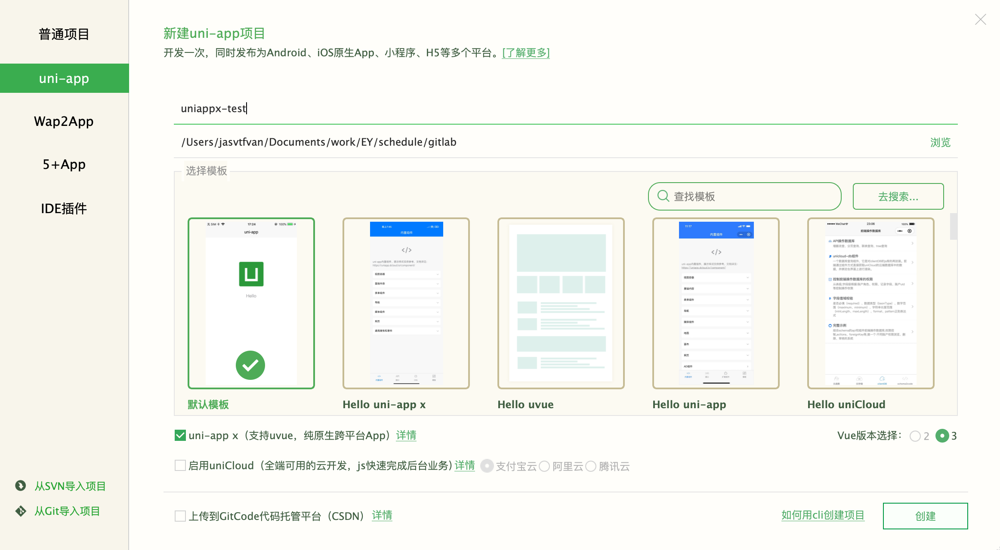

绑定开发者账户后，自动生成`Appid`，并在开发者中心可以查看

### 2.3. 生成打包资源

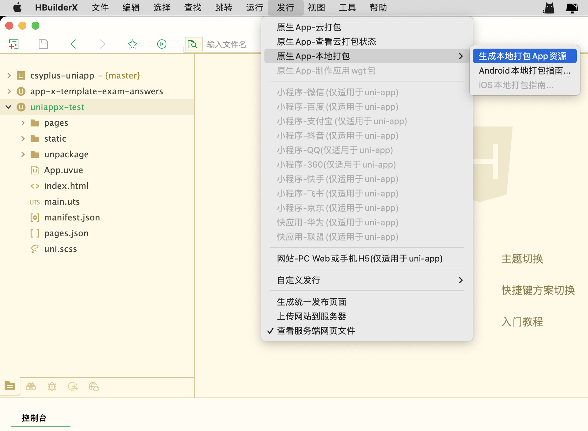

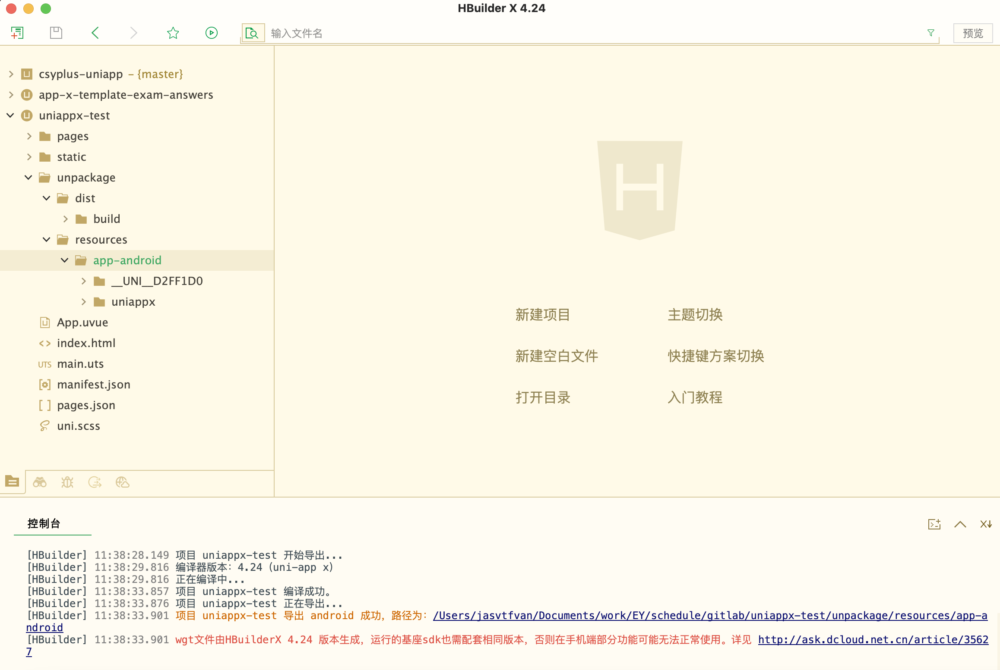

## 3. 开发者中心

官网地址: [https://dev.dcloud.net.cn](https://dev.dcloud.net.cn)

### 3.1. 管理应用

分别点击: 应用管理 -> 我的应用 -> 应用名称

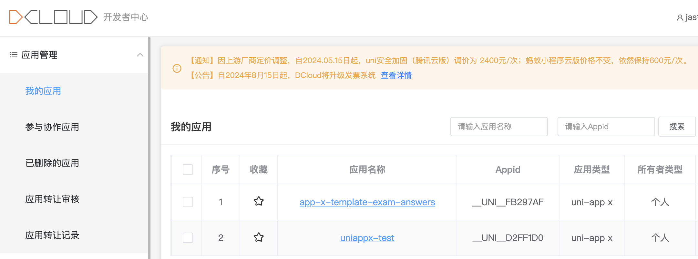

### 3.2. 创建云端证书

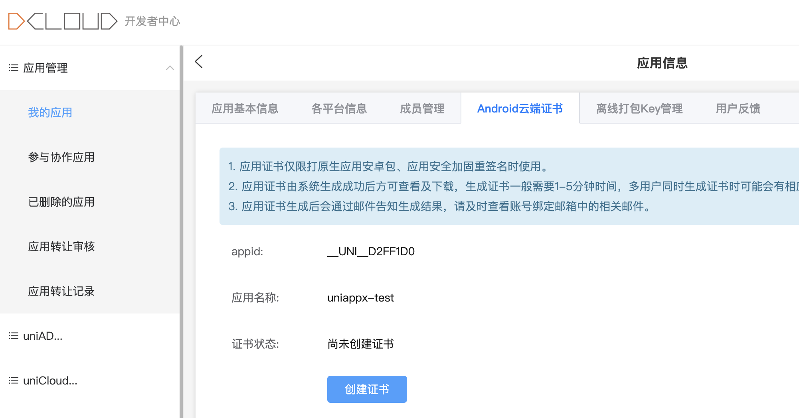

创建完成后，点击`证书详情` -> `查看证书密码` -> `下载证书`

### 3.3. 生成离线打包key

1. 新增

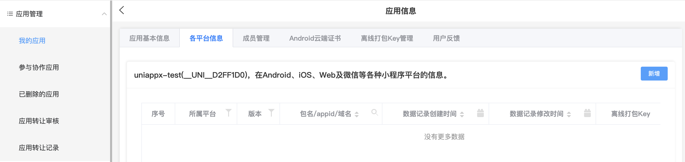

2. 创建

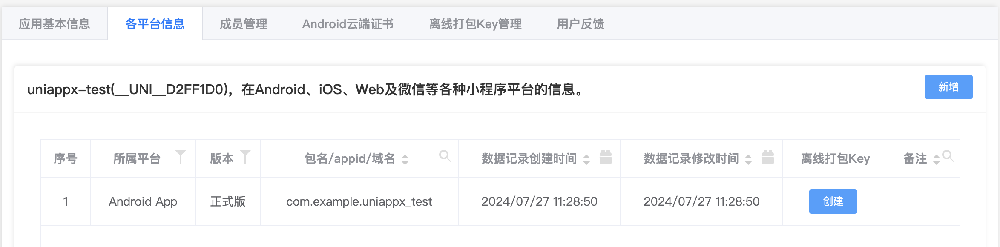

3. 查看

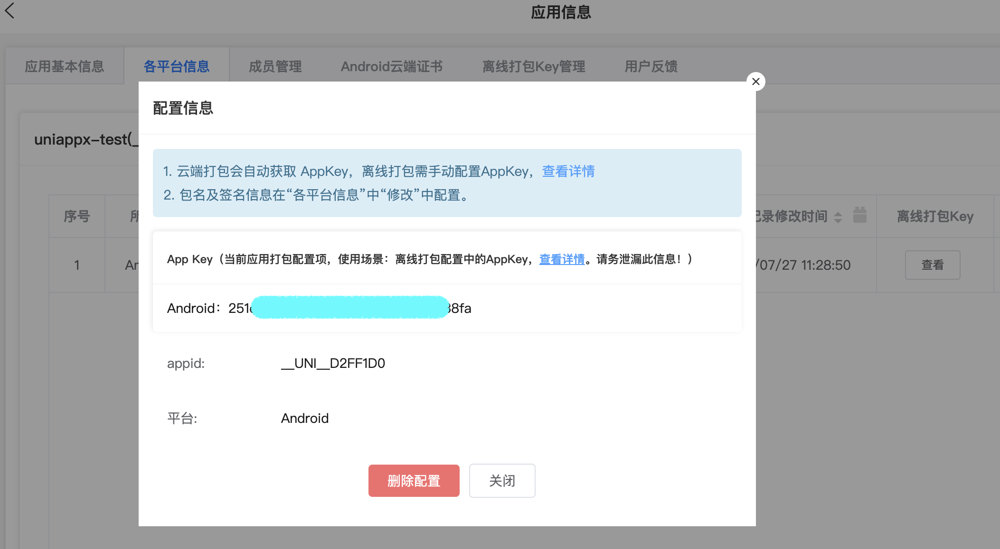

## 4. 离线Android项目

### 4.1. 导入`Android Studio`

1. 下载地址: [https://nativesupport.dcloud.net.cn/AppDocs/download/android.html](https://nativesupport.dcloud.net.cn/AppDocs/download/android.html)

>注意，下载的版本号需要跟`HBuilderX`版本号一致

2. 导入项目，目录如下

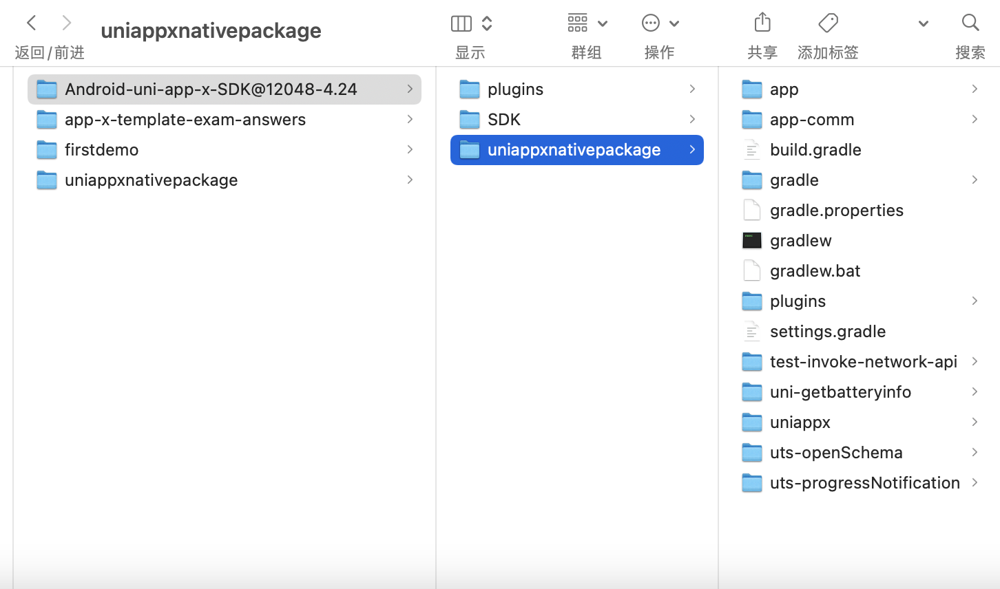

3. 修改`app`的`sdk`版本

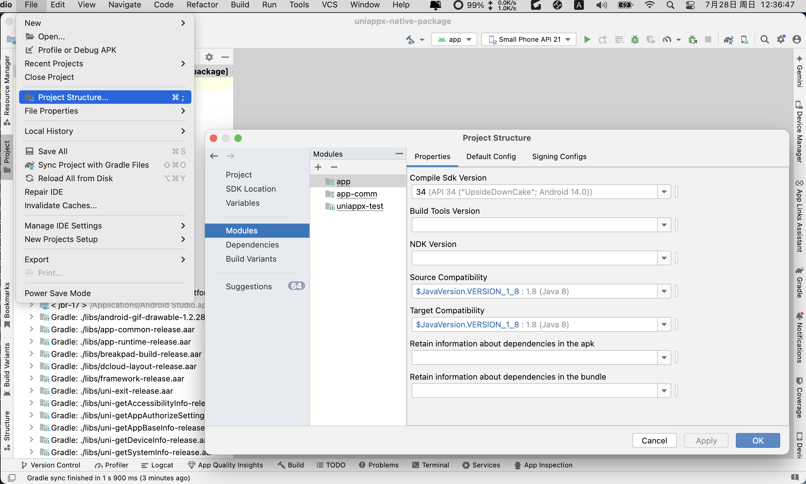

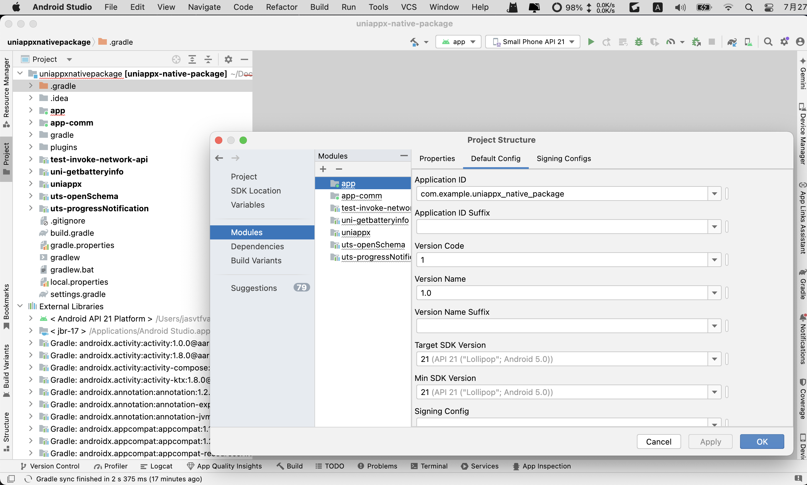

### 4.2. 根项目工程配置

1. 拷贝基础库包

将`Android-uni-app-x-SDK@12048-4.24/SDK/libs/`目录下的

```console
uts-runtime-release.aar
android-gif-drawable-1.2.28.aar
app-common-release.aar
app-runtime-release.aar
breakpad-build-release.aar
dcloud-layout-release.aar
framework-release.aar
uni-exit-release.aar
uni-getAccessibilityInfo-release.aar
uni-getAppAuthorizeSetting-release.aar
uni-getAppBaseInfo-release.aar
uni-getSystemSetting-release.aar
uni-openAppAuthorizeSetting-release.aar
uni-prompt-release.aar
uni-storage-release.aar
uni-getDeviceInfo-release.aar
uni-getSystemInfo-release.aar
uni-rpx2px-release.aar
uni-theme-release.aar
```

共19个aar拷贝到libs下，如果没有libs需要手动创建

2. `settings.gradle`配置

* `jitpack`的maven的仓库地址和本地gradle插件的路径配置

```console
dependencyResolutionManagement {
    repositoriesMode.set(RepositoriesMode.FAIL_ON_PROJECT_REPOS)
    repositories {
        flatDir { dirs('./plugins/') }
        maven { url = uri("https://jitpack.io") }
        google()
        mavenCentral()
    }
}
```

3. `gradle.properties`配置

在项目根路径下的`gradle.properties`中追加如下内容（已经存在则无需重复添加）

```console
android.useAndroidX=true
android.enableJetifier=true
```

### 4.3. app主模块配置

1. `build.gradle`

添加aaptOptions配置，修改libs路径

```console
android {
    ... ...
    aaptOptions {
        additionalParameters '--auto-add-overlay'
        ignoreAssetsPattern '!.svn:!.git:.*:!CVS:!thumbs.db:!picasa.ini:!*.scc:*~'
    }
}
dependencies {
    ... ...
    // implementation project(':uniappx-test')
    implementation fileTree(include: ['*.aar'], dir: '../libs')
}
```

2. `AndroidManifest.xml`

* 修改application的android:name
* 修改application的targetApi
* 添加activity
* 添加meta-data

```console
<application
    android:name="io.dcloud.uniapp.UniApplication"
    ... ...
    tools:targetApi="21">
<activity
    android:name="io.dcloud.uniapp.UniAppActivity"
    android:configChanges="orientation|keyboard|keyboardHidden|smallestScreenSize|screenLayout|screenSize|mcc|mnc|fontScale|navigation|uiMode"
    android:exported="true"
    android:label="@string/app_name"
    android:screenOrientation="portrait"
    android:theme="@style/UniAppX.Activity.DefaultTheme"
    android:windowSoftInputMode="adjustResize"
    tools:replace="android:label,android:exported,android:theme,android:configChanges,android:windowSoftInputMode,android:screenOrientation">
</activity>
<meta-data android:name="DCLOUD_UNI_APPID" android:value="__UNI__D2FF1D0" />
```


### 4.4. 新建`uniappx-test`模块

1. 创建模块

分别点击: File -> New -> New Module... -> Android Library

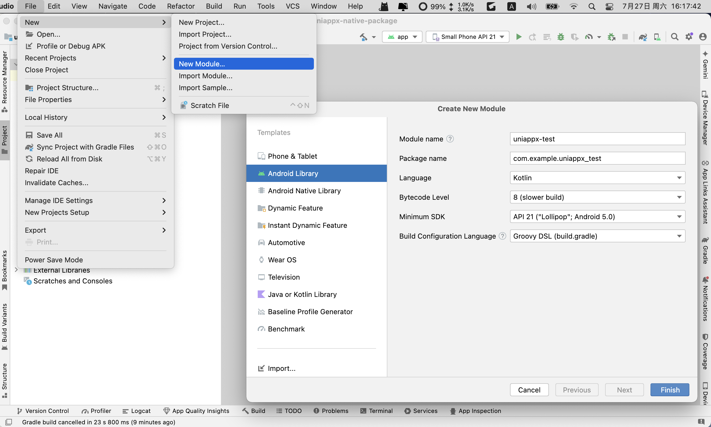

::: info 选项信息
Module Name: uniappx-test

Package Name: com.example.uniappx_test

Language: Kotlin

Bytecode Level: 8

Minimum SDK: 21

Build configuration language: Groovy DSL(build.gradle)
:::

>`Package Name`要跟开发者中心的包名一致

>uniappx-test最低支持版本为21，Minimum SDK需要选择21及以上的版本

2. 配置`build.gradle`基本信息

修改uniappx-test模块下的build.gradle

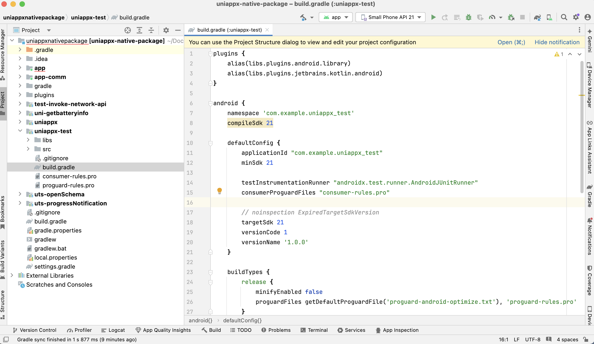

```shell
defaultConfig {
    minSdk 21

    testInstrumentationRunner "androidx.test.runner.AndroidJUnitRunner"
    consumerProguardFiles "consumer-rules.pro"

    // noinspection ExpiredTargetSdkVersion
    targetSdk 21
    versionCode 1
    versionName '1.0.0'
}
```

修改后点击`build.gradle`右上角的`Sync`

>注意：使用`noinspection ExpiredTargetSdkVersion`忽略Google Play的报错，创建虚拟机时，不要创建`Google APIs`的

### 4.5. `uniappx-test`工程配置

1. `build.gradle`配置

* 添加插件依赖
* 添加aaptOptions配置
* 添加依赖

```console
plugins {
    ... ...
    id 'io.dcloud.uts.kotlin'
}
android {
... ...
    aaptOptions {
        additionalParameters '--auto-add-overlay'
        ignoreAssetsPattern '!.svn:!.git:.*:!CVS:!thumbs.db:!picasa.ini:!*.scc:*~'
    }
}
... ...
dependencies {
	implementation fileTree(include: ['*.aar'], dir: '../libs')
	implementation("androidx.core:core-ktx:1.8.0")
	implementation("androidx.recyclerview:recyclerview:1.0.0")
	implementation("androidx.appcompat:appcompat:1.0.0")
	implementation("androidx.exifinterface:exifinterface:1.3.6")
	implementation("androidx.localbroadcastmanager:localbroadcastmanager:1.0.0@aar")
	implementation("androidx.constraintlayout:constraintlayout:2.1.4")
	implementation("com.google.android.material:material:1.4.0")
	implementation("androidx.viewpager2:viewpager2:1.1.0-beta02")
	implementation("com.alibaba:fastjson:1.2.83")
	implementation("com.facebook.fresco:fresco:3.1.3")
	implementation("com.facebook.fresco:middleware:3.1.3")
	implementation("com.facebook.fresco:animated-gif:3.1.3")
	implementation("com.facebook.fresco:webpsupport:3.1.3")
	implementation("com.facebook.fresco:animated-webp:3.1.3")
	implementation("com.github.bumptech.glide:glide:4.9.0")
	implementation("org.jetbrains.kotlinx:kotlinx-coroutines-core:1.6.4")
	implementation("org.jetbrains.kotlinx:kotlinx-coroutines-android:1.6.4")
	implementation("org.jetbrains.kotlin:kotlin-stdlib:1.9.0")
	implementation("org.jetbrains.kotlin:kotlin-reflect:1.8.10")
	implementation("org.jetbrains.kotlinx:kotlinx-serialization-json:1.4.1")
	implementation("com.squareup.okhttp3:okhttp:3.12.12")
	implementation("com.github.getActivity:XXPermissions:18.0")
}
```

> 注意: `io.dcloud.uts.kotlin`仅需要配置到uniappx模块和android uts插件模块中。主项目不需要配置。

* Sync Now

修改后点击`build.gradle`右上角的`Sync Now`

2. 配置`gradle`插件

在项目根目录的`build.gradle`的顶部添加gradle插件的依赖

```console
buildscript {
    dependencies {
        classpath(files('plugins/uts-kotlin-compiler-plugin-0.0.1.jar'))
        classpath(files('plugins/uts-kotlin-gradle-plugin-0.0.1.jar'))
    }
}
```

>检查根目录`plugins/`中是否有该依赖，如果没有则需要拷贝进来

3. 合并`AndroidManifest.xml`

* 拷贝`app`主模块的`src/main/res`到`uniappx-test`
* 拷贝`app`主模块的`AndroidManifest.xml`文件内容`uniappx-test`
* 删除`android:name=".MainActivity"`的`activity`

### 4.6. 拷贝资源文件

1. 从`HBuilderX`拷贝静态资源到app主模块

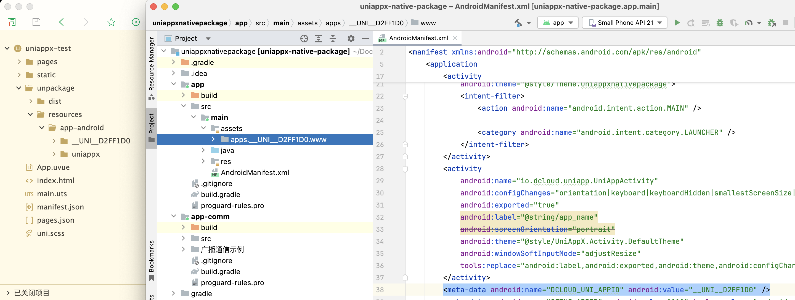

>拷贝的文件夹要与`AndroidManifest.xml`中的`DCLOUD_UNI_APPID`的值保持一致

2. 从`HBuilderX`拷贝`kotlin`代码到`uniappx-test`模块下

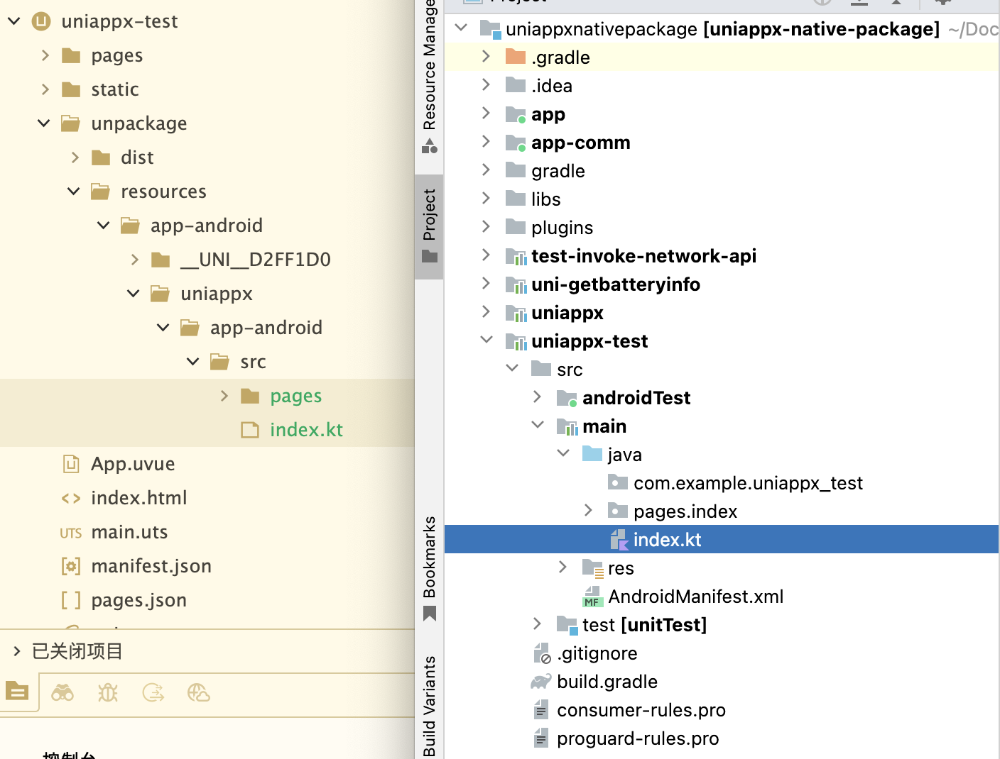

>注意：不要破环java下原有目录结构

### 4.7. `app主模块`依赖

将`uniappx-test`添加到`app主模块`依赖

```console
dependencies {
    ... ...
    implementation project(':uniappx-test')
}
```


## 10. 其他参考

### 10.1. MAC生成`.keystore`

1. 查看`jdk`地址

```bash
/usr/libexec/java_home -V
```

```console
Matching Java Virtual Machines (3):
    17.0.10 (x86_64) "Oracle Corporation" - "Java SE 17.0.10" /Library/Java/JavaVirtualMachines/jdk-17.jdk/Contents/Home
    1.8.181.13 (x86_64) "Oracle Corporation" - "Java" /Library/Internet Plug-Ins/JavaAppletPlugin.plugin/Contents/Home
    1.8.0_181 (x86_64) "Oracle Corporation" - "Java SE 8" /Library/Java/JavaVirtualMachines/jdk1.8.0_181.jdk/Contents/Home
/Library/Java/JavaVirtualMachines/jdk-17.jdk/Contents/Home
```

2. 进入`JDK`所在目录

```bash
cd /Library/Java/JavaVirtualMachines/jdk1.8.0_181.jdk/Contents/Home
```

3. 输入命令生成`.keystore`

```bash
sudo keytool -genkey -alias AAAAAA -keyalg RSA -validity 36500 -keysize 1024 -keystore java8.keystore -v
```

查看密钥信息(123456)

```bash
sudo keytool -list -v -keystore java8.keystore
```

### 10.2. HBuilderX 真机调试 (尚未成功)

1. android手机
手机设置->关于手机->版本号（连点5下开启开发者模式），在开发人员选项菜单里开启USB调试

2. MAC连接`android`设备，安装驱动助手（如：华为荣耀，安装手机助手）
根据步骤一步步连接

3. MAC打开`关于本机`->`系统报告`->`硬件/USB`->`USB 3.1 总线`
找到华为设备，复制`厂商ID`

4. 打开MAC终端，输入命令

```bash
echo 0x12d1 >> ~/.android/adb_usb.ini
```

5. 重启adb（HBuilderX）

### 10.3. HBuilderX 云打包

1. 导入本地项目

2. 选中项目，进行云打包

* 选择发行
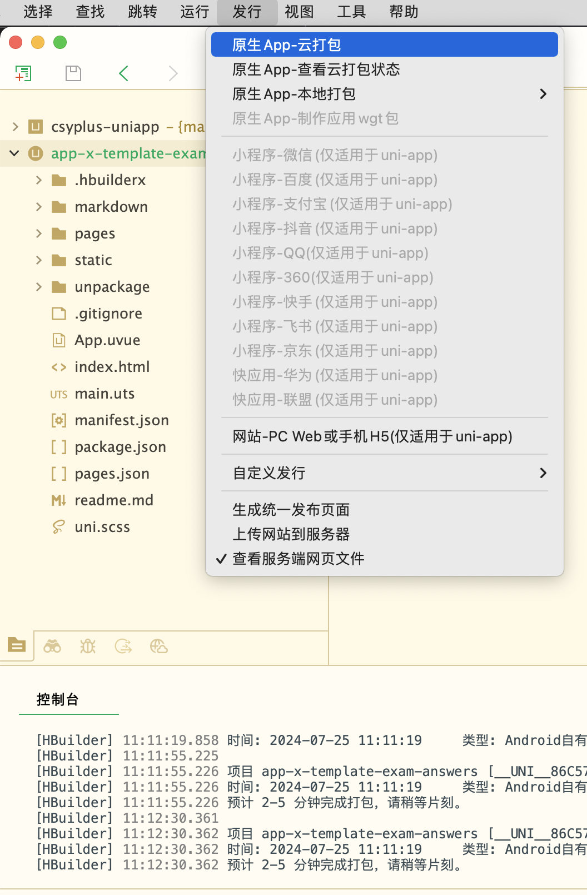

* 选择证书
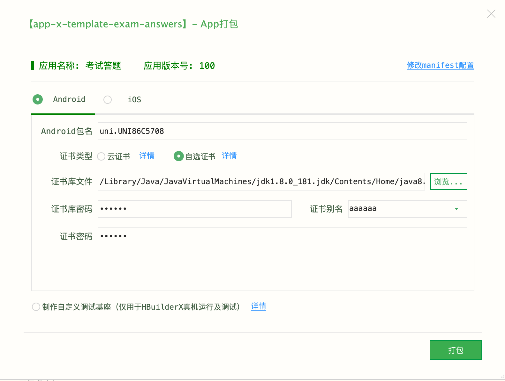

* 下载`apk`


