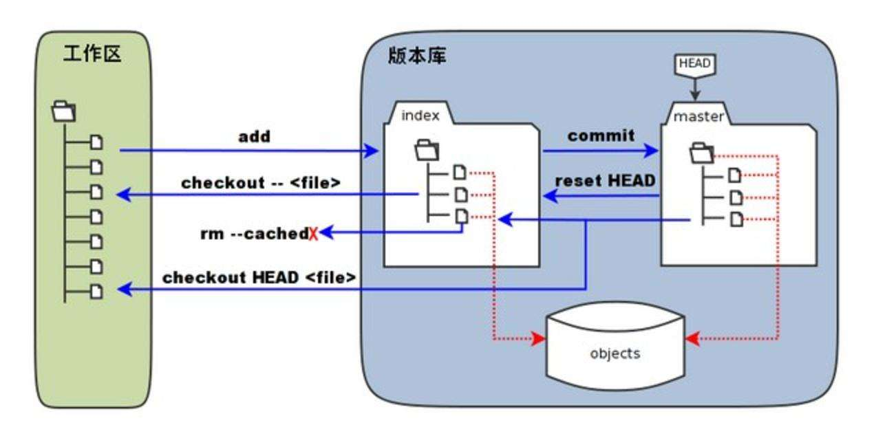
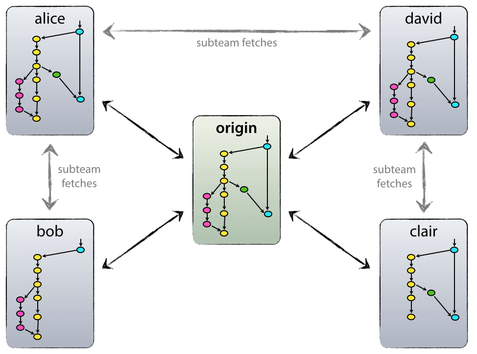

# Git 和 git-flow

## 1. Git介绍
Git是目前世界上最先进的分布式版本控制系统，由linux之父`Linus Torvalds`开发完成
### 1.1 推荐教程
[Git教程-廖雪峰的官方网站](https://www.liaoxuefeng.com/wiki/896043488029600)
### 1.2 git版本库

如上图所示。<br>
文件系统包含了`工作区`、`缓存区`和`仓库分支`。
* add命令 把`工作区`内容缓存到`缓存区`
* commit命令 把`缓存区`内容提交到`仓库分支`
* 当`工作区`内容已经添加到`缓存区`，尚未提交到`仓库分支`，<br>
使用reset HEAD还原`缓存区`，再使用checkout -- &lt;file&gt;还原`工作区`
* 当`工作区`内容已经添加到`缓存区`，并已经提交`仓库分支`，<br>
使用checkout HEAD &lt;file&gt;还原`工作区`
* **这就是本地文件系统和版本库结构**

### 1.3 git origin

如上图所示。<br>
把origin仓库作为中心仓库，跟其他仓库类似，只不过`origin`是约定的命名，就指中心仓库。<br>
每位developer都可以对origin进行pull/push操作，同时developer之间可以相互pull/push。<br>
Alice and Bob, Alice and David, and Clair and David 构成了3个小组。
* **这就是各个分布式的PC端版本库的关系，一般人们熟知的gitlab/github就处于origin这个位置。**

### 1.4 sourcetree
推荐的分支比对工具<br>
[https://www.sourcetreeapp.com/](https://www.sourcetreeapp.com/)<br>
免费工具，支持windows和macOS<br>
**建议：UI工具只用来查看或检查问题，主要功能利用命令实现**


## 2. Git客户端工具
### 2.1 工具下载
git bash: [https://git-scm.com/downloads](https://git-scm.com/downloads)
### 2.2 配置全局用户信息
```bash
$ git config --global user.name "Your Name" 
$ git config --global user.email "email@example.com"
```
>每一次commit，git会用`user.name`和`user.email`记录提交信息，**该信息与密码或秘钥等授权无关**<br>
>如果不加`--global`，可以在项目`.git`同级目录下，配置上述信息<br>
>优先级是，先到项目配置中找用户信息，如果找不到，向上找全局用户信息，如果找不到，抛出错误
### 2.3 基本操作
#### 2.3.1 创建版本库
```bash
git init
```
#### 2.3.2 提交版本库
```bash
git add <file>
git commit -m '备注信息'
```
>`第1步`添加到缓存区，`第2步`提交的版本库<br>
>file如果用`.`表示，代表把所有修改添加到缓存区

* **所有单个`file`，用`.`替换的，都代表所有文件**
#### 2.3.3 查看状态
```bash
git status
```
>`工作区`修改未添加到`缓存区`的，红色显示；<br>
>`缓存区`有内容未提交到`版本库`的，绿色显示<br>
>已经提交完毕，没有红色或绿色，并显示对应的提示信息
#### 2.3.4 对比不同
```bash
git diff
```
>默认对比`工作区`和`缓存区`不同，后边添加 `空格 HEAD`，对比`工作区`和`分支`
#### 2.3.5 查看提交日志(常用)
```bash
git log --pretty=oneline --graph --all
```
>如果内容过长，按键盘`q`退出
#### 2.3.6 查看历史命令
```bash
git reflog
```
#### 2.3.7 丢弃工作区修改
```bash
git checkout -- <file>
```
>该命令针对尚未添加到`缓存区`的<br>
>`--`是必须的，否则变成了切换分支
#### 2.3.8 丢弃缓存区修改
```bash
git reset HEAD <file>
```
>丢弃`缓存区`后，执行`2.3.7`还原工作区
#### 2.3.9 撤销提交
```bash
git reset --hard <commit-id>
```
>`HEAD^`表示&lt;commit-id&gt;代表退回到上一版本，`HEAD^^`代表上上版本，`HEAD~`100代表上100版本。<br>
>&lt;commit-id&gt;也可以是提交的`id`号，也可以是`tag`标签
```bash
git push origin HEAD --force
```
>撤销远程版本库的提交
#### 2.3.10 删除版本库
```bash
git rm <file>
```
>该命令前提是工作区已经删除某文件<br>
>如果工作区误删除，尚未提交到版本库，使用`git checkout -- <file>`还原
### 2.4 远程仓库
#### 2.4.1 配置公钥/私钥
* 查看本地公钥私钥，如果存在不再生成
```bash
ls -al ~/.ssh
```
* 生成公钥和私钥
```bash
ssh-keygen --help
cd ~/.ssh
ssh-keygen -t rsa -b 4096
```
>-t 指定加密方式<br>
>-b 字节数<br>
* 开启ssh代理
```bash
eval "$(ssh-agent -s)"
ssh-add ~/.ssh/id_rsa
```
>加速秘钥验证过程
* 添加公钥的`github/gitlab`<br>
复制`id_rsa.pub`中的内容，添加到`Account setting`中`SSH Keys`页面。
#### 2.4.2 添加远程仓库
```bash
git remote add origin 远程仓库地址
```
#### 2.4.3 首次推送分支到远程仓库
```bash
git push -u origin master
```
>`master`是把本地`master`分支推送到远程`master`分支
#### 2.4.4 非首次推送分支到远程仓库
```bash
git push origin master
```
>`master`是把本地`master`分支推送到远程`master`分支，也可以推送其他分支如`develop`
#### 2.4.5 克隆远程仓库
```bash
git clone 远程仓库地址
```
#### 2.4.6 拉取远程仓库
```bash
git pull origin master
```
>`origin master`可以省略，默认为`origin master`
#### 2.4.7 查看远程仓库地址
```bash
git remote -v
```
#### 2.4.8 通过远程仓库创建分支
```bash
git fetch origin dev
git checkout -b dev origin/dev
```
>git pull === git fetch & git merge
### 2.5 分支管理
#### 2.5.1 创建分支
```bash
git checkout -b develop
```
>实际上分两条命令
>>git branch develop
>>git checkout develop
#### 2.5.2 查看分支
```bash
git branch
```
>显示所有分支，当前分支高亮显示
#### 2.5.3 切换分支
```bash
git checkout master
```
#### 2.5.4 合并分支
```bash
git merge develop
git merge --no-ff -m "merge with no-ff" dev
```
>已经切换到`master`分支，将`develop`分支内容合并到`master`上<br>
>默认`fast forward`模式，合并后删除合并痕迹<br>
>加`空格 --no-ff`禁用`fast forward`，合并后痕迹保留
>加`空格 -m`添加备注
#### 2.5.5 删除分支
```bash
git branch -d feature1
git push origin -d feature1
```
>`-d`尚未合并抛出异常，合并后放可以删除分支<br>
>`-D`强制删除分支，不要合并就可以删除<br>
>第2条删除远程分支
### 2.6 冲突解决
#### 2.6.1 push操作
如果远程更新了`file1`，本地修改了`file1`，当执行`push`操作时，会报错并提示
1. 拉取最新代码
```bash
git pull
```
2. 解决冲突
>`<<<<<< , ======= , >>>>>>` 标记了要解决的冲突
3. 再次`push`
### 2.7 标签管理
#### 2.7.1 新建标签
* 简略写法
```bash
git tag <tagName> <commit-id>
```
>`<commit-id>`可以不写，默认执行HEAD
* 完整写法
```bash
git tag -a <tagName> -m '备注信息' <commit-id>
```
>`-a`指定标签名，`-m`执行备注信息
#### 2.7.2 显示标签详细信息
```bash
show <tagName>
```
#### 2.7.3 显示所有标签名称
```bash
git tag
```
#### 2.7.4 推送标签到远程
```bash
git push origin <tagName>
```
#### 2.7.5 推送所有标签到远程
```bash
git push origin --tags
```
#### 2.7.6 删除本地标签
```bash
git tag -d <tagName>
```
#### 2.7.7 删除远程标签
```bash
git push origin :refs/tags/<tagName>
```
### 2.8 工作现场
`git stash`命令只能用于本地，不能用于远程
#### 2.8.1 储藏工作现场
```bash
git stash
```
>在创建紧急`bug`分支前，还有代码尚未提交到版本库，并且工作进行到半路，不希望提交<br>
>`git status`会发现是干净的，没有尚未提交的代码
#### 2.8.2 查看列表
```bash
git stash list
```
>stash@{0}: WIP on dev: f52c633 add merge
#### 2.8.3 恢复现场，不删除数据
```bash
git stash apply
```
>后边添加`空格 stash@{0}`指向具体数据
#### 2.8.4 删除栈顶
```bansh
git stash drop
```
>后边添加`空格 stash@{0}`指向具体数据
#### 2.8.5 恢复现场，删除栈顶数据
```bash
git stash pop
```
### 2.9 自定义标签
有时为了方便，自定义标签也比较常用，这里举几个简单例子
```bash
git config --global alias.co checkout
git config --global alias.ci commit
git config --global alias.br branch
git config –-global alias.st status
```
### 2.30 避免bug重复劳动
```bash
git cherry-pick <commit>
```
>在master分支上修复的bug，想要合并到当前dev分支<br>
>使用该命令，把bug提交的修改“复制”到当前分支，避免重复劳动

## 3. RSA密钥对配置
github、gitee、gitlab等多账号配置
### 3.1 别名法（推荐）
1. 生成新的密钥对
```sh
ssh-keygen -t rsa -C anotherEmail@163.com
```
2. 修改密钥对文件名，不要覆盖默认的
>Enter file in which to save the key (/Users/$USER/.ssh/id_rsa):
```sh
/Users/$USER/.ssh/id_rsa_another
```
3. 查看`config`文件是否存在
```ls ~/.ssh/```
4. 创建config文件
```touch ~/.ssh/config```
5. 编辑config文件
```vim ~/.ssh/config```
```sh
#Default
Host gitee.com
Hostname gitee.com
Port 443
IdentityFile ~/.ssh/id_rsa
PubkeyAcceptedAlgorithms +ssh-rsa
HostkeyAlgorithms +ssh-rsa

Host github.com
Hostname github.com
IdentityFile ~/.ssh/id_rsa
PubkeyAcceptedAlgorithms +ssh-rsa
HostkeyAlgorithms +ssh-rsa

Host 123.56.159.153
Hostname 123.56.159.153
Port 443
IdentityFile ~/.ssh/id_rsa
PubkeyAcceptedAlgorithms +ssh-rsa
HostkeyAlgorithms +ssh-rsa

#SnapInspect
Host s.github.com
Hostname github.com
Port 443
IdentityFile ~/.ssh/id_rsa_snapinspect
PubkeyAcceptedAlgorithms +ssh-rsa
HostkeyAlgorithms +ssh-rsa
```
6. 测试弱链接
```sh
ssh -T git@gitee.com
ssh -vT git@github.com -p 22
ssh -p 9222 -T git@123.56.159.159
ssh -T -v git@s.github.com
```
>公式`ssh -T -v git@[config配置的host值]`,-v显示详细信息<br>
>`PubkeyAcceptedAlgorithms +ssh-rsa`和`HostkeyAlgorithms +ssh-rsa`用来兼容新老版本差异
>如果有科学上网，需要命令窗口开启终端代理，参见`shadowsocks`

### 3.2 切换法（不推荐）
1. 生成新的密钥对
```sh
ssh-keygen -t rsa -C anotherEmail@163.com
```
2. 修改密钥对文件名，不要覆盖默认的
>Enter file in which to save the key (/Users/$USER/.ssh/id_rsa):
```sh
/Users/$USER/.ssh/id_rsa_another
```
3. 查看`ssh agent`
```ssh-add -l```
4. 添加使用的密钥到`agent`，其中`-K`放到keychain中
```sh
ssh-add -K ~/.ssh/id_rsa_another
```
>删除其中一个`ssh-add -d ~/.ssh/id_rsa`
>如果临时使用不要加`-K`
5. 查看`ssh agent`
```ssh-add -l```
6. 切换到`id_rsa_another`密钥，默认密钥将失效

## 4. git-flow（适合复杂工程）
### 4.1 git-flow介绍
git工作流，就像代码需要代码规范一样，代码管理同样需要一个清晰的流程和规范<br>
`Vincent Driessen` 为了解决这个问题提出了 [A Successful Git Branching Model](https://nvie.com/posts/a-successful-git-branching-model/)
### 4.2 git-flow分支图


### 4.3 各分支职责
#### 4.3.1 Master分支
**主分支**，唯一且稳定的分支。只能来自`Release`或`Hotfix`的合并。
#### 4.3.2 Develop分支
**开发分支**，唯一的。从该分支新建`Feature`分支，并将`Feature`分支合并到该分支。<br>
发布`Release`分支<br>
合并`Hotfix`分支，前提是`Release`分支不存在
#### 4.3.3 Feature分支
**功能分支**，从`Develop`创新新功能，完成后合并到`Develop`。<br>
如果push到远程服务器origin，可以协作开发。
#### 4.3.4 Release分支
**发布版本分支**，同一时间只有一个`Release`分支。<br>
测试修复bug，注意少量bug。<br>
合并到`Master`和`Develop`，并打tag。
#### 4.3.5 Hotfix分支
**紧急修复分支**，基于`Master`分支，修复bug后合并会`Master`分支，并且打tag。<br>
如果`Release`存在，则合并到`Release`，否则合并到`Develop`。

### 4.4 git-flow安装
```bash
 brew install git-flow-avh
```

### 4.5 git-flow命令
#### 4.5.1 初始化命令
```bash
git flow init
```
#### 4.5.2 feature命令
* 创建一个feature
```bash
git flow feature start feature1
```
>创建了一个基于`develop`的特性分支，并切换到`feature1`
* 完成一个feature
```bash
git flow feature finish feature1
```
>合并`feature1`分支到`develop`，删除`feature1`分支，切换回`develop`分支
#### 4.5.3 release命令
* 创建一个release
```bash
git flow release start v1.0.1
```
>创建了一个基于`develop`的预发版分支
* 完成一个release
```bash
git flow release finish v1.0.1
```
>合并`release`分支到`master`和`develop`，打`tag`，删除`release`分支
* push标签
```bash
git push --tags
```
#### 4.5.4 hotfix命令
* 创建一个hotfix
```bash
git flow hotfix start v1.0.2
```
>创建了一个基于`master`的紧急修复分支，并切换到`hotfix`
* 完成一个hotfix
```bash
git flow hotfix finish v1.0.2
```
>合并`hotfix`分支到`master`，如果`release`存在，合并到`release`，否则合并到`develop`<br>
>删除`hotfix`分支，切换回`develop`分支
#### 4.5.5 通用命令
* 发布
```bash
git flow <feature/release> publish <feature1/v1.0.1>
```
* 拉取
```bash
git flow <feature/release> pull origin <feature1/v1.0.1>
```
