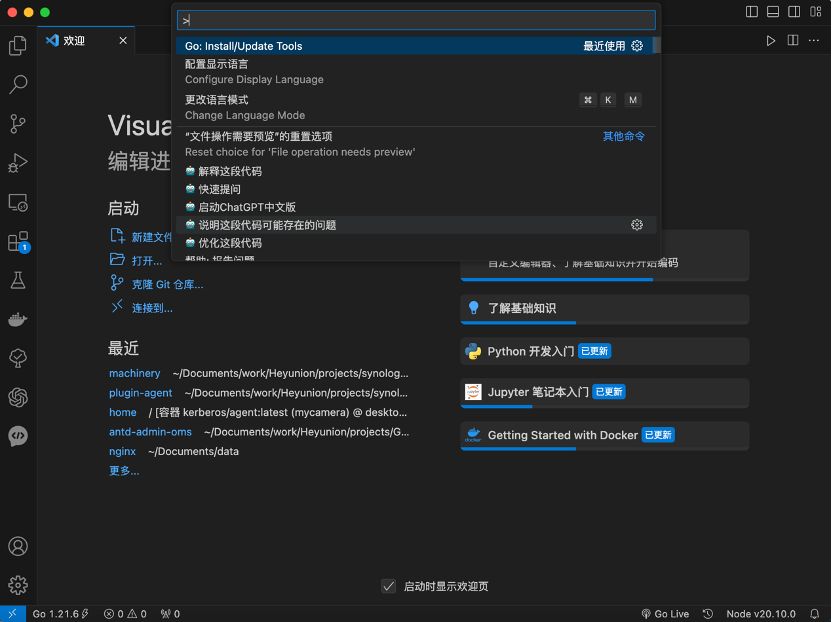
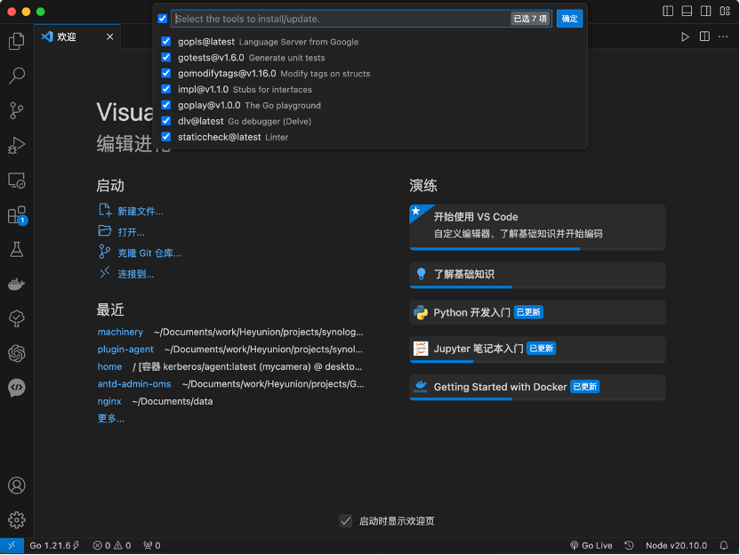

# go

## 1. 多版本管理

官网地址:

[https://github.com/moovweb/gvm](https://github.com/moovweb/gvm)

### 1.1. 安装gvm

```sh
bash < <(curl -s -S -L https://raw.githubusercontent.com/moovweb/gvm/master/binscripts/gvm-installer)
```

>安装

```sh
cat ~/.zshrc
```

```console
source /Users/$USER/.bash_profile
[[ -s "/Users/$USER/.gvm/scripts/gvm" ]] && source "/Users/$USER/.gvm/scripts/gvm"
```

>查看.zshrc

```sh
source .zshrc
```

>执行source

```sh
gvm version
```

>查看`gvm`版本

### 1.2 常用命令

```sh
gvm list
```

>查看已经安装版本

```sh
gvm listall
```

>查看可安装版本

```sh
gvm install go1.20 -B
```

>安装指定版本

```sh
gvm use go1.20
```

>切换到指定版本

```sh
gvm use go1.20 –default
```

>切换指定一个默认版本

## 2. go安装

根据**1.2**的安装命令安装

```sh
go version
```

>查看版本

```sh
go env -w GO111MODULE=on
go env -w GOPROXY=https://goproxy.cn,direct
```

>修改env代理配置

## 3. vscode插件安装

1. command+shift+p
打开vscode命令面板，选择Go:Install/Update Tools


2. 下载安装

全部选中点击“确定”进行下载安装。
