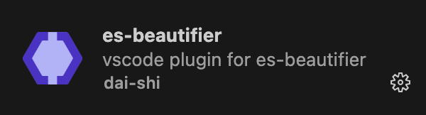
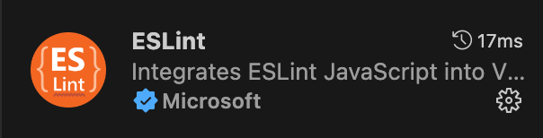
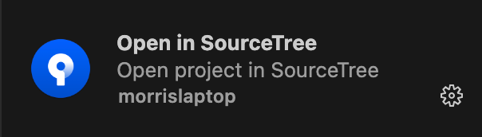

# VSCODE

## 1. 工具下载
[https://code.visualstudio.com/](https://code.visualstudio.com/)

## 2. 插件安装
如下图，左侧菜单第6个功能，左上方输入框搜索

### 2.1 插件推荐
1. 简体中文

2. es-beautifier（es语法美化）

3. eslint（前端标准检查）

4. go（golang语言美化）

5. Open in Source Tree（git可视化）

6. Go Interface Annotations（接口实现类关系）

